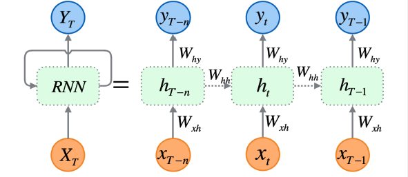
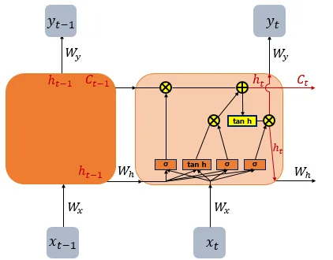
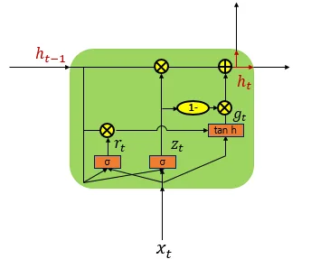
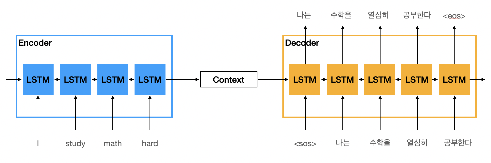

1주차는 텍스트가 `(batch, seq_len, d)` 모양의 텐서가 되기까지를 다뤘습니다. 그런데 이 텐서를 실제로 읽어 다음 단어를 예측하려면, 순서가 있고 길이도 제각각인 시퀀스를 모델이 어떻게 처리할지가 또 다른 문제로 남습니다. 어텐션이 등장하기 전, 이 문제가 가장 첨예하게 드러난 과제가 번역이었습니다. 문장을 통째로 읽고 다른 언어의 문장으로 다시 써내야 하니, 순서와 길이를 다루는 문제가 고스란히 걸려 있었습니다. RNN, LSTM, GRU, Seq2Seq는 모두 이 번역이라는 과제를 풀어나가며 자리 잡은 방식입니다. 이번 글에서는 이 네 가지를 따라가 보겠습니다.

# 목차

1. RNN (Recurrent Neural Network)
2. LSTM (Long Short-Term Memory)
3. Seq2Seq (Sequence-to-Sequence)

# 1. RNN (Recurrent Neural Network)

문장은 길이가 제각각이고 단어 순서를 바꾸면 뜻도 바뀝니다. RNN은 토큰을 한 번에 하나씩, 순서대로 읽어서 이 문제를 풉니다. 매 시점 `t`에서 입력 `x_t`와 이전 시점의 hidden state `h_{t-1}`을 받아 새로운 `h_t`를 만듭니다.

```
h_t = tanh(W_x · x_t + W_h · h_{t-1})
```



`h_t`는 지금까지 읽은 토큰을 압축한 요약입니다. 문장이 몇 토큰이든 `h_t`의 크기는 고정이고, 같은 `W_x`, `W_h`를 모든 시점에서 재사용합니다. 가중치가 시점마다 따로 있는 게 아니라 공유되므로, 시퀀스 길이가 몇이든 파라미터 수는 그대로입니다.

### 기울기 소실

문제는 문장이 길어질 때 생깁니다. 역전파는 `h_t`에서 `h_1`까지 거슬러 올라가며 매 시점 `W_h`를 곱합니다.

```
∂h_t/∂h_1 = W_h × W_h × ... × W_h   (t-1번 곱함)
```

`W_h`의 고윳값이 1보다 작으면 이 곱이 0으로 수렴하고, 1보다 크면 무한대로 발산합니다. 시퀀스가 길수록 곱하는 횟수가 늘어나므로, 앞쪽 시점의 정보는 뒤로 갈수록 gradient가 사라져 학습에 반영되지 않습니다. RNN이 긴 문장에서 앞부분을 기억하지 못하는 이유입니다.

# 2. LSTM (Long Short-Term Memory)

RNN은 기울기 소실 때문에 문장이 길어지면 앞부분을 기억하지 못합니다. LSTM은 `h_t`와 별도로 cell state `C_t`라는 통로를 하나 더 둬서 이 문제를 보완합니다. `C_t`는 게이트를 거쳐 값이 더해지거나 지워질 뿐, `h_t`처럼 매번 행렬을 곱해 새로 만들어지지 않습니다. 그래서 정보가 여러 시점을 지나도 gradient가 덜 죽습니다.



세 개의 게이트가 `C_t`를 조절합니다.

- forget gate: 이전 `C_{t-1}`에서 무엇을 지울지 정합니다
- input gate: 새 정보 중 무엇을 `C_t`에 더할지 정합니다
- output gate: `C_t` 중 무엇을 `h_t`로 내보낼지 정합니다

각 게이트는 시그모이드(σ)로 0~1 사이 값을 내는 작은 신경망이고, 그 값이 정보를 얼마나 통과시킬지를 정합니다.

### GRU

GRU는 LSTM을 단순화한 버전입니다. cell state를 따로 두지 않고 `h_t` 하나로 합치고, 게이트도 3개에서 2개(reset, update)로 줄였습니다.



구조는 가벼워졌지만 성능은 LSTM과 비슷한 경우가 많아, 파라미터를 줄이고 싶을 때 대안으로 씁니다.

### 입출력 길이 문제

RNN도 LSTM도 토큰을 하나 읽을 때마다 출력을 하나씩 내는 구조입니다. 입력과 출력이 사실상 한 몸이라, 번역처럼 입력과 출력의 길이 자체가 다른 문제에는 그대로 쓸 수 없습니다.

# 3. Seq2Seq (Sequence-to-Sequence)

RNN도 LSTM도 토큰을 하나 읽을 때마다 출력을 하나씩 내보내는 구조라, 입력과 출력의 길이가 다른 번역에는 쓸 수 없습니다. Seq2Seq는 이 구조를 RNN(LSTM) 두 개로 나눠서 풉니다. 하나는 입력을 읽기만 하는 인코더, 다른 하나는 출력을 만들어내는 디코더입니다.

```
인코더: h_t = RNN(x_t, h_{t-1})        context = h_T
디코더: s_t = RNN(y_{t-1}, s_{t-1})     s_0 = context
```



인코더는 입력 문장을 끝까지 읽고 마지막 hidden state `h_T`로 압축합니다. 이 벡터가 context입니다. 디코더는 이 context를 초기 상태로 받아 `<sos>`(start of sequence)부터 문장을 만들기 시작하고, 매 시점 자신의 출력을 다음 입력으로 삼아 토큰을 하나씩 예측하다가 `<eos>`(end of sequence)가 나오면 멈춥니다.

학습할 때는 디코더의 다음 입력으로 예측이 아니라 정답 토큰을 넣습니다. 초반 예측이 틀려도 오류가 뒤로 번지지 않게 하기 위해서고, 이 방식을 teacher forcing이라고 부릅니다. 매 시점이 정답을 입력받아 다음 토큰만 맞히면 되므로, 이전 시점의 실수와 무관하게 각 시점이 독립적으로 학습됩니다. 추론할 때는 정답이 없으므로 자신의 예측을 그대로 다음 입력으로 씁니다.

입력을 읽는 일과 출력을 만드는 일이 서로 다른 네트워크로 갈라지면서, 입력 길이와 출력 길이가 더는 묶여 있지 않습니다.

### 고정 길이 병목

다만 인코더가 디코더로 넘기는 것은 마지막 시점의 hidden state, 즉 고정 크기 벡터 하나뿐입니다. 문장이 길어질수록 그 안에 눌러 담아야 하는 정보만 늘어나 병목이 생깁니다. 실제로 Seq2Seq는 문장이 길어질수록 번역 품질이 눈에 띄게 떨어졌습니다.

# 마무리

RNN이 기울기 소실로 긴 문장을 못 읽자 LSTM이 게이트로 보완했고, RNN과 LSTM이 입력·출력 길이가 다른 문제를 못 풀자 Seq2Seq가 인코더와 디코더로 나눴습니다. 어텐션 이전 자연어처리는 이렇게 한계를 하나씩 메우며 나아갔습니다.

그런데 Seq2Seq는 두 가지 한계를 남겼습니다.

하나는 방금 본 고정 길이 병목입니다. 문장 전체를 벡터 하나에 눌러 담아야 하니, 문장이 길어질수록 정보가 손실됩니다. 다른 하나는 RNN, LSTM, Seq2Seq가 전부 공유하는 문제입니다. `h_t`를 구하려면 `h_{t-1}`이 먼저 나와야 하므로 토큰을 순서대로 하나씩만 계산할 수 있고, 병렬로 처리할 수 없습니다. 문장이 길어질수록 학습과 추론 모두 느려집니다.

어텐션은 첫 번째 문제를 풉니다. 디코더가 context 하나만 보는 대신, 인코더의 모든 시점 hidden state를 매번 다시 들여다보게 합니다. 문장이 아무리 길어도 필요한 부분을 그때그때 찾아 쓸 수 있어 병목이 사라집니다.

두 번째 문제인 순차 계산은 어텐션만으로는 풀리지 않습니다. 이걸 마저 푸는 것이 3주차에서 다룰 Transformer입니다. Transformer는 RNN을 걷어내고 어텐션만으로 문장을 한 번에 처리해서, 순서대로 계산해야 한다는 제약 자체를 없앱니다.
