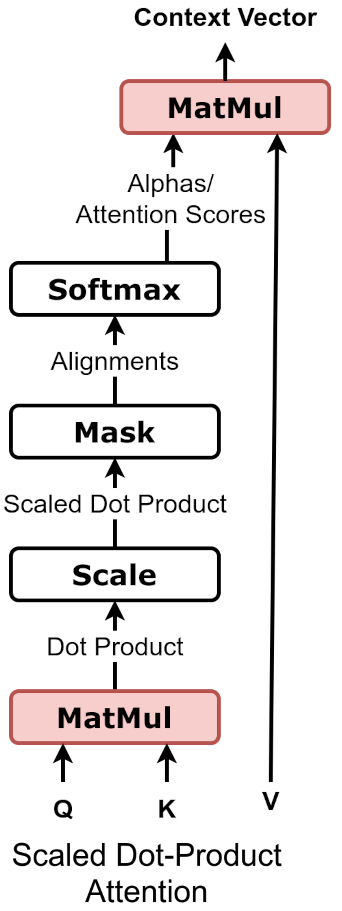
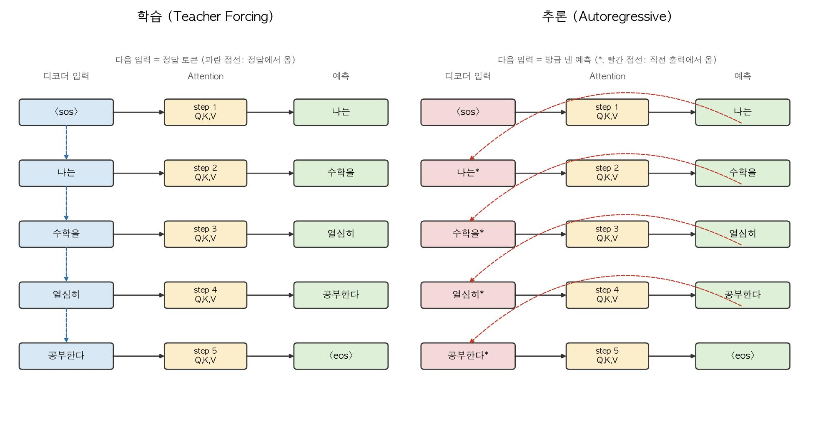

2주차는 RNN에서 LSTM을 거쳐 Seq2Seq까지 왔지만, 문장 전체를 고정 길이 벡터 하나에 욱여넣는 병목이 남았습니다. 이번 글에서는 이 병목을 Attention이 어떤 아이디어로 풀었는지, 그리고 그 계산을 이루는 Query, Key, Value가 각각 무슨 일을 하는지 따라가 보겠습니다.

# 목차

1. Seq2Seq에서 Attention
2. Query
3. Key
4. Value
5. 두 가지 어텐션 방식
6. 마무리

# 1. Seq2Seq에서 Attention

`I study math hard` → `나는 수학을 열심히 공부한다`를 다시 봅시다. 어순이 그대로 대응되지 않습니다. `study`는 두 번째 단어인데 그 번역 `공부한다`는 맨 마지막에 나옵니다.

Seq2Seq는 디코더가 `공부한다`를 만드는 순간에도 인코더의 **마지막** hidden state 하나(context)만 봅니다. RNN은 문장을 순서대로 읽으며 hidden state를 계속 새로 쓰기 때문에, 마지막 hidden state는 최근에 읽은 단어들의 영향을 가장 크게 받습니다. `study`처럼 앞쪽에서 읽은 정보는 그 안에 흐려져 있을 가능성이 큽니다.

2주차 실습에서 이 예측을 실제로 확인했습니다. 짧은 문장(2~4단어)은 정확도 0.53이었는데, 긴 문장(7~8단어)은 0.38까지 떨어졌습니다. **문장이 길어질수록 그 안의 모든 정보를 context 벡터 하나에 눌러 담기 버거워진다는 뜻입니다.**

인코더는 사실 매 시점마다 hidden state를 만들어뒀습니다. $h_1$(`I`을 읽은 직후), $h_2$(`study`까지 읽은 직후) 처럼요. Seq2Seq는 이걸 다 만들어놓고 마지막 것만 쓰고 나머지는 버립니다. **다 버리지 말고, 디코더가 지금 필요한 것을 그때그때 골라 쓰면 어떨까?** 이 질문에서 Attention이 나왔습니다(Bahdanau et al., 2015, *Neural Machine Translation by Jointly Learning to Align and Translate*).

- 디코더가 '공부한다'를 만들 차례 → $h_2$ ('study'를 읽은 시점)를 크게 참고
- 디코더가 '나는'을 만들 차례 → $h_1$ ('I'을 읽은 시점)를 크게 참고

시점마다 어느 $h_i$를 얼마나 참고할지가 매번 달라집니다. 논문에서는 이걸 “정렬(alignment)을 모델이 스스로 학습한다”고 표현했습니다. 사람이 `study`↔︎`공부한다`라는 대응을 미리 정해주는 게 아니라, 모델이 번역을 학습하는 과정에서 그 대응 관계를 스스로 찾아낸다는 뜻입니다. 이 “얼마나 참고할지”를 정하는 계산이 Query, Key, Value로 이루어집니다.

여기서 Query는 **디코더**에서, Key와 Value는 **인코더**에서 나옵니다. 서로 다른 두 시퀀스가 마주 보고 있어서 이런 구조를 **cross-attention**이라고 부릅니다. Query, Key, Value가 전부 같은 시퀀스에서 나오는 self-attention과는 다릅니다. self-attention은 다음 주 Transformer에서 다룹니다.

# 2. Query

Query는 **디코더가 지금 이 순간 무엇을 찾고 있는지**를 나타내는 벡터입니다. 디코더가 토큰을 하나 만들 때마다 새로 만들어집니다.

$$
q_t = s_{t-1} · W_Q
$$

디코더의 직전 hidden state $s_{t-1}$을 그대로 쓰지 않고, 학습되는 가중치 행렬 $W_Q$를 곱해서 만듭니다. $s_{t-1}$은 “지금까지 무슨 단어를 만들었는가”를 담은 벡터인데, $W_Q$가 그중에서 “다음 단어를 고르려면 무엇을 물어봐야 하는가”에 필요한 부분만 뽑아내도록 학습됩니다.

검색창에 입력하는 검색어에 비유할 수 있습니다. `나는`을 막 만들고 다음 단어를 준비하는 시점의 query와, `열심히`까지 만들고 `공부한다`를 준비하는 시점의 query는 다릅니다. 디코더가 문장을 만들어갈수록 “지금 필요한 게 뭔지”에 대한 질문 자체가 계속 바뀌기 때문입니다.

# 3. Key

Key는 **인코더의 각 시점이 무엇을 담고 있는지**를 나타내는 벡터입니다. Query와 대조되어 “이 시점이 지금 얼마나 관련 있는가”를 재는 데 쓰입니다.

$$
k_i = h_i · W_K
$$

여기서도 인코더의 hidden state $h_i$를 그대로 쓰지 않고 $W_K$를 곱합니다. $h_i$에는 그 시점까지 읽은 문장의 온갖 정보가 다 들어있는데, $W_K$가 그중에서 “다른 시점의 query와 비교하기 좋은 형태”로 골라내도록 학습됩니다.

검색어와 대조되는 색인에 비유할 수 있습니다. 검색엔진이 검색어를 각 문서의 색인과 비교해 점수를 매기듯, 디코더의 query를 인코더의 모든 key와 하나씩 비교해 “지금 이 시점이 필요한가”를 점수로 매깁니다.

# 4. Value

Value는 **점수가 매겨진 뒤 실제로 가져올 내용물**입니다.

$$
v_i = h_i · W_V
$$

$W_K$와 마찬가지로 $h_i$에 별도의 가중치 $W_V$를 곱합니다. $W_K$가 “비교에 유리한 형태”를 뽑아내는 역할이라면, $W_V$는 “가져다 쓰기 좋은 형태”를 뽑아내는 역할입니다. 같은 $h_i$에서 출발해도 목적이 다르니 다른 가중치를 씁니다.

검색 결과로 실제로 받는 문서 원문에 비유할 수 있습니다. Key는 “이 문서가 검색어와 관련 있는지”를 판단하는 역할이고, Value는 관련 있다고 판단된 뒤 “실제로 가져오는 내용”입니다. 비교하는 기준(Key)과 가져오는 내용(Value)을 분리해두면, 같은 $h_i$에서 출발하더라도 “무엇을 기준으로 찾을지”와 “무엇을 돌려줄지”를 서로 다르게 학습할 수 있습니다.

이제 Query, Key, Value가 다 모였으니 이걸 어떻게 조합하는지가 남았습니다.

$$
\begin{aligned}
e_i &= q_t^\top k_i \\
\alpha_i &= \frac{\exp(e_i)}{\sum_j \exp(e_j)} \\
c_t &= \sum_i \alpha_i v_i
\end{aligned}
$$

- $e_i$: Query와 Key의 유사도(score)
- $α_i$: Attention weight
- $c_t$: 해당 시점의 Context vector

여기서 “유사도를 어떻게 잴 것인가”를 두고 유명한 두 갈래가 갈립니다.

# 5. 두 가지 어텐션 방식

## 5.1. Bahdanau Attention (additive)

Bahdanau의 원래 논문(2015)은 $q_t$와 $k_i$를 이어붙여 작은 신경망 하나에 통과시켜 점수를 냈습니다.

$$
score_i = v^T · tanh(W_q · q_t + W_k · k_i)
$$

학습 가능한 파라미터가 더 필요한 대신, $q_t$와 $k_i$의 차원이 달라도 쓸 수 있고 표현력이 좋습니다.

## 5.2. Luong Attention (dot-product)

Luong et al.(2015)은 신경망 없이 내적 하나로 점수를 냈습니다.

$$
score_i = q_t · k_i
$$

숫자로 따라가 보겠습니다. 인코더가 3시점(`I`, `study`, `math`)을 읽었고, 디코더가 `공부한다`를 만들려는 참이라 가정합니다.

```
score = [1.2, 4.5, 0.8]                   # study 시점(2번째)과 가장 잘 맞음
softmax(score) ≈ [0.05, 0.90, 0.05]       # 점수를 확률처럼 정규화
context = 0.05·v_1 + 0.90·v_2 + 0.05·v_3  # v_2(study) 쪽으로 거의 쏠림
```

`study`를 읽은 $h_2$의 key가 지금 query와 잘 맞아 $α_2$가 크게 나왔고, `context`는 $v_2$ 쪽으로 크게 기울어졌습니다. 이 `context`가 디코더 시점마다 매번 다시 계산되므로, Seq2Seq처럼 문장 전체 정보를 벡터 하나에 미리 눌러 담아둘 필요가 없습니다. 2주차의 고정 길이 병목이 이렇게 풀립니다.



## 5.3. Transformer의 선택

Transformer(2017)는 이 중 **내적 방식**을 채택했습니다. 신경망을 안 거치고 행렬곱 한 번으로 끝나 계산이 훨씬 빠르기 때문입니다. 다만 벡터 차원($d_k$)이 커지면 내적 값 자체가 커져 softmax가 한쪽으로 쏠리는 문제가 있어, $√d_k$로 나눠주는 보정을 하나 추가했습니다.

$$
score_i = (q_t · k_i) / √d_k
$$

이걸 scaled dot-product attention이라고 부릅니다. Transformer는 다음 주에 볼 것처럼 RNN을 걷어내고 이 행렬곱 연산 하나에 크게 의존하는 구조라, 속도가 빠른 쪽을 택한 것입니다.

## 5.4. 학습과 추론 플로우 차트



# 마무리

Seq2Seq는 인코더가 만든 모든 정보를 context 벡터 하나에 미리 압축해뒀습니다. Attention은 그 압축을 그만두고, 디코더가 필요할 때마다 Query로 물어보고 Key로 대조해서 Value를 그 자리에서 가져옵니다. 문장이 길어져도 필요한 부분을 직접 찾아 쓸 수 있어 병목이 사라집니다.

이번 글에서 다룬 건 Query가 디코더, Key와 Value가 인코더로 나뉜 **cross-attention**입니다. 두 시퀀스(인코더·디코더)가 있어야 성립하는 구조입니다.

다만 Key와 Value로 쓰이는 $h_i$는 여전히 인코더가 RNN으로 순서대로 만든 것입니다. $h_i$를 구하려면 $h_{i-1}$이 먼저 나와야 하니, 인코더 내부의 순차 계산은 그대로 남아 있습니다. 이 문제를 RNN 자체를 걷어내고 Attention만으로 푸는 것이 다음 주에 다룰 Transformer입니다. 그때는 Query, Key, Value가 전부 하나의 시퀀스에서 나오는 **self-attention**을 씁니다. 디코더 없이 인코더 혼자서도 성립하는 구조입니다.