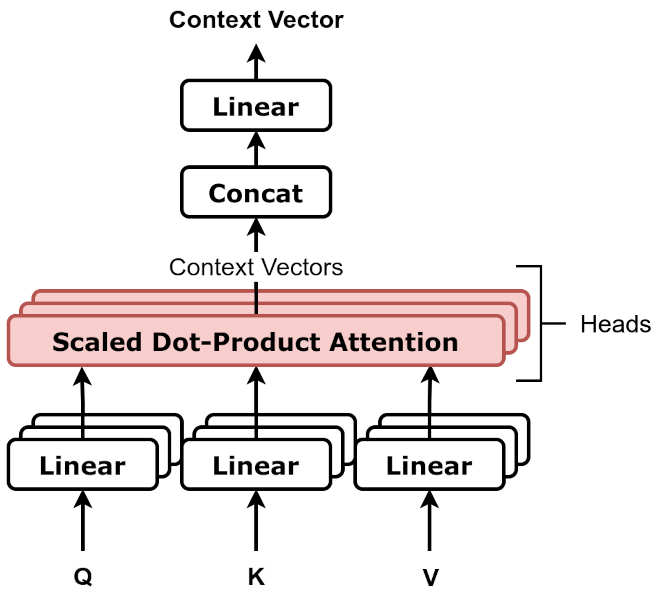
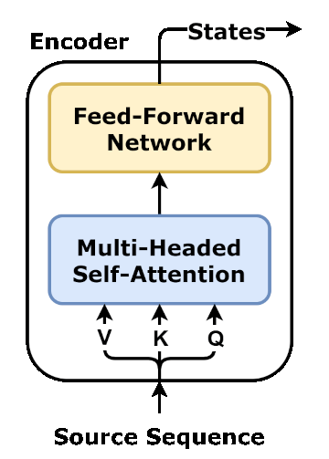
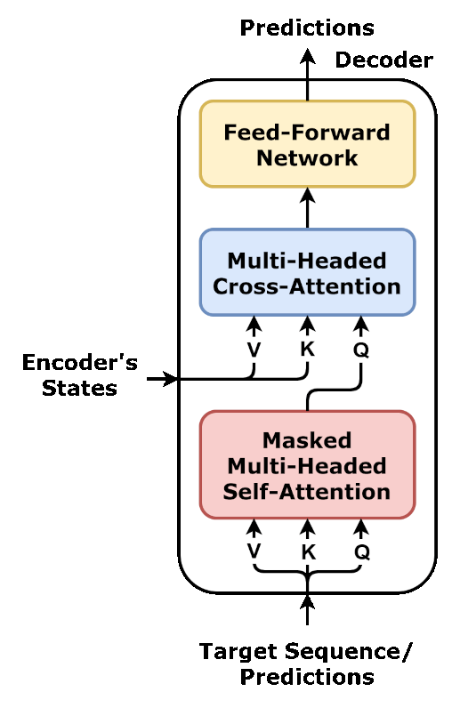

3주차는 Attention으로 Seq2Seq의 고정 길이 병목을 풀었지만, Key와 Value로 쓰인 $h_i$는 여전히 인코더가 RNN으로 순서대로 만든 것이었습니다. $h_i$를 구하려면 $h_{i-1}$이 먼저 나와야 하니, 인코더 내부의 순차 계산은 그대로 남았습니다. 이번 글에서는 이 순차 계산을 Self-Attention이 어떻게 없앴는지, 그리고 그걸로 조립한 Transformer가 어떤 구조인지 살펴보겠습니다.

전체 그림을 먼저 보면 이렇습니다. 이제부터 이 그림을 하나씩 뜯어보겠습니다.


# 목차

1. Cross-Attention에서 Self-Attention으로
2. 포지셔널 인코딩 (Positional Encoding)
3. 멀티헤드 어텐션 (Multi-Head Attention)
4. 인코더 블록
5. 디코더 블록
6. 마무리

# 1. Cross-Attention에서 Self-Attention으로

3주차의 Attention은 Query가 디코더, Key와 Value가 인코더로 나뉜 cross-attention이었습니다. 인코더가 $h_i$를 만드는 과정 자체는 그대로 RNN이었고, 그래서 $h_1, h_2, ..., h_i$를 순서대로 계산해야 하는 문제가 남았습니다.

Self-Attention은 Query, Key, Value를 전부 같은 시퀀스에서 만듭니다. 디코더가 필요 없습니다.

$$
Q = X \cdot W_Q, \quad K = X \cdot W_K, \quad V = X \cdot W_V
$$

`I love math`라면, `love`가 자기 표현을 새로 만들 때 `I`, `love`, `math` 전부를 동시에 봅니다. `love`의 Query가 `I`의 Key, `love`의 Key, `math`의 Key와 동시에 비교되고, 그 결과로 나온 가중치로 세 Value를 섞습니다.

$$
\text{Attention}(Q, K, V) = \text{softmax}\left(\frac{QK^\top}{\sqrt{d_k}}\right) V
$$

RNN은 $h_3$을 구하는 식 안에 $h_2$가 재료로 직접 들어갑니다. $h_2$가 먼저 나와 있지 않으면 $h_3$을 계산할 방법이 없어서, 한 칸씩만 앞으로 나아갈 수 있습니다.

$$
h_1 = f(x_1, h_0), \quad h_2 = f(x_2, h_1), \quad h_3 = f(x_3, h_2)
$$

Self-Attention의 $Q, K, V$는 전부 원본 $X$에서 바로 나옵니다. `love`의 Query를 만드는 식 $X_{\text{love}} \cdot W_Q$ 어디에도 `I`나 `math`의 결과가 들어가지 않습니다. 그래서 세 토큰의 $Q, K, V$를 동시에 계산해도 아무 문제가 없고, 그 뒤 "누가 누구를 얼마나 참고하는가"를 정하는 $QK^\top$도 모든 토큰 쌍을 한 번에 비교하는 행렬곱 하나로 끝납니다. RNN이 한 칸씩 릴레이로 넘겨주던 것을, Self-Attention은 다들 같은 원본을 동시에 보고 그 자리에서 찾아오는 방식으로 바꾼 것입니다. 3주차 마무리에서 남겨둔 순차 계산 문제가 이렇게 풀립니다.

# 2. 포지셔널 인코딩 (Positional Encoding)

RNN에서는 $h_t$를 만들 때 $h_{t-1}$을 입력으로 받았습니다. 이 재귀 계산 자체가 "지금이 몇 번째인지"를 암묵적으로 담고 있었습니다. `math`의 $h_3$는 `I`와 `love`를 먼저 거쳐야만 나올 수 있으니, 순서는 계산 구조에 이미 박혀 있었습니다.

Self-Attention은 이 재귀를 버렸습니다. $Q, K, V$를 만드는 계산 $X \cdot W_Q$는 각 토큰에 독립적으로, 위치와 무관하게 똑같이 적용됩니다. 그래서 `개가 고양이를 물었다`와 `고양이가 개를 물었다`처럼 단어 집합은 같고 순서만 다른 두 문장을 Self-Attention에 그대로 넣으면, 어느 쪽 단어가 몇 번째에 있었는지에 대한 정보가 계산 과정 어디에도 없습니다.

Transformer는 각 위치마다 고유한 벡터를 만들어 토큰 임베딩에 그대로 더하는 방식으로 이 정보를 되돌려줍니다.

$$
PE_{(pos, 2i)} = \sin\left(\frac{pos}{10000^{2i/d}}\right), \qquad
PE_{(pos, 2i+1)} = \cos\left(\frac{pos}{10000^{2i/d}}\right)
$$

$$
h_0 = \text{embedding}(x) + PE
$$

$pos$는 토큰이 몇 번째인지, $i$는 벡터의 몇 번째 차원입니다. 위치마다 다른 sin·cos 값이 나오므로, 같은 단어라도 1번째에 오는지 5번째에 오는지에 따라 최종 입력 벡터가 달라집니다. `개`가 `개가 고양이를`의 1번째에 올 때와 `고양이가 개를`의 3번째에 올 때, 이제는 서로 다른 벡터로 시작합니다.

sin·cos 값 자체는 학습되지 않습니다. 수식으로 정해지는 고정된 숫자라 파라미터가 없고, 역전파도 닿지 않습니다.

GPT-2는 이 고정된 함수 대신, 1주차에서 본 임베딩 행렬과 똑같은 방식으로 위치 임베딩 표를 따로 하나 더 두고 학습시킵니다. 랜덤으로 시작해 학습을 거치며 채워지는, 옵티마이저가 갱신하는 학습 대상이라는 점도 같습니다. 값을 고정된 수식으로 정해두는지, 데이터로부터 학습하는지가 다를 뿐, 목적은 같습니다. Self-Attention이 재귀를 버리며 잃어버린 순서를 되돌려주는 것입니다.

Transformer 원논문은 실제로 둘 다 실험했는데, 번역 성능 차이는 거의 없었습니다. 그런데도 고정된 sin·cos를 최종으로 택한 이유는 성능이 아니라 확장성입니다. 학습형 표는 학습 때 본 위치까지만 행이 있어서, 그보다 긴 문장이 들어오면 아예 처리할 방법이 없습니다. sin·cos는 수식이라 몇 번째 위치든 그냥 계산하면 나옵니다. 다만 실무에서는 GPT, BERT 모두 학습형을 씁니다. 컨텍스트 길이를 어차피 정해두고 쓰는 경우가 대부분이라 sin·cos의 확장성이 덜 중요하고, 정해진 범위 안에서는 학습형이 태스크에 맞게 더 유연하게 최적화되기 때문입니다.

# 3. 멀티헤드 어텐션 (Multi-Head Attention)

`The animal didn't cross the street because it was too tired`라는 문장에서 `it`을 봅시다. `it`의 Self-Attention은 Query 하나로 이 문장의 다른 모든 단어와 비교합니다. 그런데 `it`이 지금 필요로 하는 정보는 한 가지가 아닙니다.

- `it`이 가리키는 대상이 뭔지 알려면 `animal`을 봐야 합니다.
- `it`에 걸리는 서술어가 뭔지 알려면 `was`, `tired`를 봐야 합니다.

Query, Key, Value가 각각 하나씩만 있으면, 이 두 가지를 하나의 가중치 분포에 같이 담아야 합니다.

```
animal: 0.42   tired: 0.38   나머지: 0.20
```

둘 다 어느 정도는 담기지만, 어느 쪽도 뚜렷하지 않습니다. `context`는 이 가중치들의 평균이라, `animal` 쪽 정보도 `tired` 쪽 정보도 흐릿하게 섞인 벡터 하나로 뭉뚱그려집니다.

Multi-Head Attention은 애초에 $Q, K, V$를 여러 벌로 나눠서, head마다 따로 가중치를 계산합니다.

```
head 1: animal 0.91   tired 0.03   나머지 0.06   (지시 대상 쪽으로 확실히 쏠림)
head 2: animal 0.04   tired 0.87   나머지 0.09   (서술어 쪽으로 확실히 쏠림)
```

한 head가 두 관계를 어정쩡하게 나눠 갖는 대신, head마다 한 관계에 확실히 쏠립니다. head마다 $W_i^Q, W_i^K, W_i^V$가 따로 있어서 가능한 일입니다.

같은 문장을 8명의 채점자에게 동시에 주는 것과 비슷합니다. 8명 다 같은 답안(문장)을 보지만, 채점 기준(가중치)이 각자 달라서 어떤 사람은 지시어 관계만, 어떤 사람은 문법 관계만 눈여겨봅니다. 8명의 채점 결과를 다 모으면(Concat), 한 명이 혼자 모든 기준으로 채점하려 했을 때보다 다양한 각도의 정보가 남습니다. 여덟 head가 같은 계산을 반복하는 게 아니라, 같은 입력을 서로 다른 파라미터로 각자 다르게 보는 것입니다.

$$
\text{head}_i = \text{Attention}(QW_i^Q, KW_i^K, VW_i^V)
$$

$$
\text{MultiHead}(Q,K,V) = \text{Concat}(\text{head}_1, ..., \text{head}_h) \cdot W^O
$$



한 벡터의 차원(예: 512)을 head 수(예: 8)만큼 쪼개 각 head가 더 작은 차원(64)에서 계산하므로, head를 여러 개 쓴다고 전체 계산량이 그만큼 늘어나지도 않습니다. 이렇게 얻은 head들을 이어붙이고(Concat) 한 번 더 선형변환($W^O$)해서 하나의 벡터로 합칩니다.

# 4. 인코더 블록

`I love math`가 인코더 블록 하나를 통과하는 과정입니다.



1. **Multi-Head Self-Attention**: `I`, `love`, `math`가 서로를 참고해 각자의 표현을 새로 만듭니다. `love`의 새 표현에는 `I`, `math`의 정보가 섞여 들어갑니다.
2. **Feed-Forward Network**: 그렇게 섞인 정보를 토큰별로 독립적으로 다듬습니다.

Self-Attention의 출력은 Value들의 가중합이라 계산 자체가 선형입니다. 아무리 여러 토큰을 참고해도 섞는 비율만 바뀔 뿐 새로운 특징을 만들지는 못합니다. FFN이 이 비선형 가공을 맡습니다.

$$
\text{FFN}(x) = \max(0, x W_1 + b_1) W_2 + b_2
$$

벡터를 넓은 차원(512→2048)으로 펼쳤다가 `ReLU`를 거쳐 다시 원래 차원으로 압축합니다. 모든 위치에 같은 $W_1, W_2$를 쓰므로 `I`, `love`, `math`는 서로 안 보고 각자 같은 변환을 따로 받습니다. FFN을 거쳐도 토큰은 여전히 3개(`I_out`, `love_out`, `math_out`)입니다. 여러 토큰이 하나로 합쳐지는 게 아니라, Self-Attention이 이미 모아둔 벡터 하나하나가 각자 다듬어질 뿐입니다.

블록 사이에는 잔차 연결(residual connection)도 있습니다. 각 층의 입력을 출력에 그대로 한 번 더 더해서, 층을 깊게 쌓아도 원래 입력이 곧장 다음 층까지 전달되는 우회로를 열어둡니다.

$$
\text{out} = \text{Layer}(x) + x
$$

# 5. 디코더 블록

디코더 블록은 인코더 블록에 두 가지가 더 있습니다.



**Masked Self-Attention**은 디코더 자신이 지금까지 만든 토큰끼리 서로 참고하는 Self-Attention입니다. 다만 자기보다 뒤에 오는 토큰은 못 보게 막아둡니다. `나는 수학을`까지 만든 시점이라면, `수학을`은 `나는`을 볼 수 있어도 아직 만들지 않은 `열심히`는 볼 수 없습니다.

이 마스킹이 왜 필요한지는 3주차에서 다룬 teacher forcing과 맞닿아 있습니다. 학습할 때는 `나는 수학을 열심히 공부한다`라는 정답 문장을 통째로 디코더에 넣고 한 번에 계산합니다. 그런데 마스킹이 없으면 Self-Attention은 모든 토큰을 동시에 보는 게 기본이라, `수학을`을 계산할 때 미래의 `열심히`, `공부한다`까지 미리 봐버립니다. 실제 추론에서는 있을 수 없는 상황(아직 만들지도 않은 단어를 참고)이 학습 때만 가능해지는 것이라, 마스킹으로 미래 위치의 점수를 $-\infty$로 만들어 막아둡니다.

**Multi-Headed Cross-Attention**은 3주차에서 다룬 그 attention입니다. Query는 디코더(방금의 Masked Self-Attention 출력), Key와 Value는 인코더의 최종 출력에서 옵니다. 인코더 쪽이 이제 RNN이 아니라 Self-Attention으로 바뀌었을 뿐, "디코더가 인코더를 참고한다"는 얼개는 그대로입니다.

이 두 Attention과 Feed-Forward Network를 하나의 블록으로 묶어 디코더도 여러 층 쌓습니다.

# 6. 마무리

인코더의 순차 계산이 병목으로 남자 Self-Attention이 RNN을 걷어냈고, 그 대가로 잃은 순서는 포지셔널 인코딩으로, 부족해진 관점은 멀티헤드로 보완했습니다. 이 부품들을 묶은 인코더 블록과, 여기에 Cross-Attention까지 더한 디코더 블록을 쌓은 것이 Transformer입니다.

GPT-2는 이 중 디코더 블록만 쌓은 구조입니다. 인코더가 없으니 Cross-Attention도 없고, Masked Self-Attention만으로 지금까지 나온 토큰을 참고해 다음 토큰을 예측합니다. RNN에서 시작한 4주간의 이야기가 여기서 GPT-2로 다시 이어집니다.

디코더만 쌓으면 GPT가 되는데, 그럼 인코더만 쌓으면, 혹은 원래대로 둘 다 쌓으면 무엇이 될까요. 다음 주에는 Encoder-only(BERT), Decoder-only(GPT), Encoder-Decoder(T5) 세 갈래가 같은 부품을 어떻게 다르게 조합하는지 다루겠습니다.
