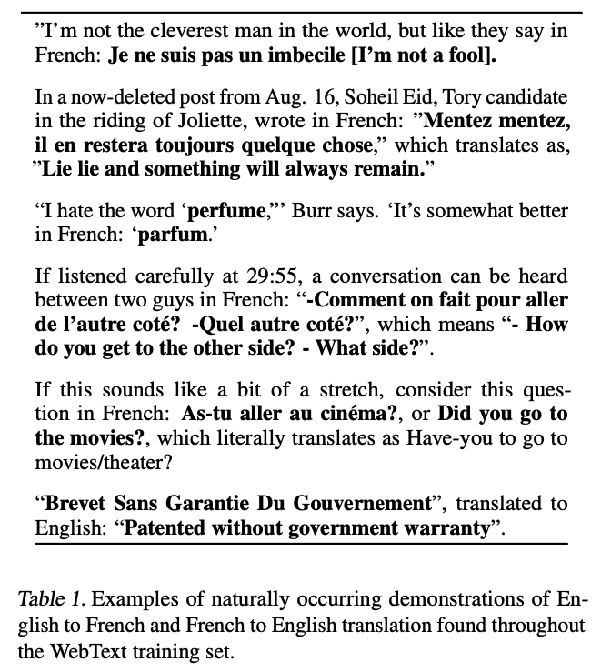

1주차는 GPT-2가 텍스트를 텐서로 바꾸는 과정을 봤습니다. 2주차는 RNN이 그 텐서를 순서대로 읽다가 기울기 소실과 입출력 길이 문제에 부딪히는 걸 봤고, 3주차는 Attention이 인코더의 모든 시점을 다시 참조해 고정 길이 병목을 풀었습니다. 4주차는 그 인코더마저 RNN에서 Self-Attention으로 바꿔, 순서 정보를 포지셔널 인코딩으로, 관점 부족을 멀티헤드로 보완한 Transformer를 조립했습니다. 그리고 4주차 마무리에서 GPT-2가 이 중 디코더 블록만 쌓은 구조라는 것까지 확인했습니다.

이번 글에서는 4주간 조립해온 부품이 실제로 어떤 논문에 담겨 있었는지, GPT-2 원 논문(Radford et al., 2019, *Language Models are Unsupervised Multitask Learners*)을 직접 리뷰하겠습니다.

# 목차

1. 배경
2. 아키텍처
3. 실험 셋팅
4. 실험 결과
5. 마무리

# 1. 배경

2019년 이전까지 머신러닝 시스템은 대개 태스크마다 데이터셋을 모으고, 그 데이터로 지도학습을 시키고, 같은 분포의 held-out 데이터로 평가하는 방식으로 만들어졌습니다. 이 방식은 특정 태스크 하나는 잘 푸는 "좁은 전문가"를 만드는 데는 성공적이었지만, 데이터 분포가 조금만 달라지거나 입력이 살짝만 낯설어져도 성능이 쉽게 무너집니다. 논문은 이런 시스템을 "**유능한 일반가(competent generalist)**가 아니라 **좁은 전문가(narrow expert)**"라고 짚습니다.

이 한계를 풀려는 흐름 중 하나가 **전이학습**이었고, 논문은 그 흐름을 세 단계로 정리합니다.

1. 단어 벡터(word2vec 등)를 학습해 다른 모델의 입력으로 씀
2. RNN이 만든 문맥 표현(contextual representation)을 전이해서 씀
3. Self-Attention 블록 자체를 전이해서 씀(GPT, BERT)

점점 더 유연한 형태로 전이되어 왔지만, 세 단계 모두 결국 **태스크마다 다시 지도학습(fine-tuning)이 필요**하다는 공통점이 있습니다. **태스크 전용 아키텍처는 필요 없어졌어도, 라벨링된 데이터 없이는 여전히 그 태스크를 수행할 수 없었습니다.**

한편 다른 갈래에서는 **언어모델 자체가 fine-tuning 없이도 상식 추론이나 감성 분석 같은 특정 태스크를 어느 정도 수행할 수 있다는 관찰**도 있었습니다. 논문은 이 두 흐름을 연결합니다. 언어모델을 fine-tuning 없이 **여러 태스크에 그대로 옮겨(zero-shot task transfer) 쓸 수 있는가**가 이 논문의 질문입니다. 이걸 검증하려면 언어모델이 특정 도메인에 갇히지 않고 아주 다양한 텍스트를 봐야 합니다. 그래서 다음 장에서 볼 아키텍처만큼이나, 어떤 데이터로 학습시켰는지가 이 논문에서 중요한 축이 됩니다.

# 2. 모델 프로세스

## 2.1. Tokenizer

1주차에서 다룬 BPE는 유니코드 문자 단위로 어휘를 만들면 기본 어휘만 13만 개를 넘습니다. GPT-2는 이 대신 **바이트 단위(byte-level) BPE**를 씁니다. 바이트는 256가지뿐이라 기본 어휘가 256개로 시작하고, 여기에 병합 규칙을 추가해 나갑니다.

다만 바이트 단위로 그대로 병합하면 `dog`, `dog.`, `dog!`, `dog?`처럼 같은 단어의 변형이 전부 다른 병합으로 쌓여 어휘 슬롯을 낭비합니다. GPT-2는 이를 막으려고 **문자 카테고리를 넘나드는 병합을 금지**했습니다. 알파벳과 마침표가 하나로 합쳐지는 걸 막는 식입니다. 공백만 예외를 둬서 압축 효율을 크게 해치지 않으면서도 단어가 지나치게 조각나는 걸 피했습니다. 이 결과로 만들어진 어휘가 1주차에서 본 그 50,257개입니다.

## 2.2. 모델 아키텍쳐

GPT-2가 푸는 문제는 "지금까지 나온 토큰을 보고 다음 토큰을 맞히는 것" 하나뿐입니다. 번역이나 요약처럼 원문과 결과물이 따로 있는 게 아니라, 자기가 만들어가는 글 하나를 계속 이어 쓸 뿐입니다. 그래서 4주차에서 본 두 블록 중 인코더는 필요가 없습니다. **참고할 별도의 원문 자체가 없으니, 인코더의 결과를 가져다 쓰는 Cross-Attention도 있을 이유가 없습니다.** 남는 건 디코더 블록(Masked Self-Attention + Feed-Forward)뿐이고, GPT-2는 이걸 그대로 쌓은 구조입니다.

디코더 블록만 남았으니 자기보다 미래의 토큰은 못 보게 막는 마스킹은 그대로 필요합니다. 지금까지 나온 토큰만으로 다음 토큰을 예측해야, 실제로 문장을 만들어나갈 때(추론)와 학습할 때의 조건이 같아지기 때문입니다. 논문은 이 구조를 크기만 다르게 4개 학습시켰습니다.

가장 작은 117M은 원조 GPT와 크기가 같고, 두 번째인 345M은 BERT의 가장 큰 모델과 크기가 같습니다. 흔히 “GPT-2”라고 부르는 건 가장 큰 1542M 모델입니다. 1주차에서 본 `V=50,257, d=768`은 이 표의 첫 줄, 117M 모델의 설정이었습니다.

## 2.3. vanilla Transformer에서 달라진 점

4주차에서 본 구조와 완전히 같지는 않습니다. 두 가지가 바뀌었습니다.

1. **Layer Normalization 위치**
    
    vanilla Transformer는 Self-Attention과 FFN을 거친 뒤에 정규화를 했습니다($\text{LayerNorm}(x + \text{Layer}(x))$). GPT-2는 반대로 각 서브블록에 들어가기 **전에** 정규화를 하고, 마지막 블록을 다 지난 뒤에 정규화를 한 번 더 추가했습니다. 이렇게 **입력 쪽에 정규화를 두는 방식을 pre-activation이라고 부르는데, 층을 아주 깊게(48층까지) 쌓을 때 학습이 더 안정적입니다.**
    
2. **잔차 경로 초기화**
    
    4주차에서 본 잔차 연결 $\text{out} = \text{Layer}(x) + x$은 층을 지날 때마다 값이 계속 더해져 쌓입니다. GPT-2는 층 수 $N$이 많을수록 이 누적이 커진다는 걸 감안해, **잔차 경로에 있는 가중치를 초기화할 때 $1/\sqrt{N}$을 곱해 처음부터 작게 시작합니다.**
    

그 외에 어휘는 50,257개로, 컨텍스트 길이는 512에서 1024로, 배치 크기는 512로 늘렸습니다. 1주차에서 다룬 `n_positions=1024`가 여기서 나온 숫자입니다.

# 3. 실험 셋팅

## 3.1. 데이터셋

기존 언어모델은 대개 뉴스나 위키피디아처럼 한 종류의 글만 모아 학습했습니다. **GPT-2는 다양한 주제와 문체를 모으는 쪽**을 택했습니다. Common Crawl 같은 웹 스크랩은 양은 많지만 품질이 들쭉날쭉해서, 논문은 대신 **Reddit에서 karma(추천) 3점 이상을 받은 게시물의 외부 링크**를 모았습니다. 사람들이 한 번 걸러낸 글이라는 걸 품질 지표로 삼은 것입니다.

이렇게 모은 문서가 800만 개, 텍스트로 40GB이고, 이 데이터셋을 **WebText**라고 부릅니다. 다른 벤치마크와 겹칠 수 있는 위키피디아 문서는 아예 뺐습니다.

## 3.2. 학습 방법

GPT-2는 **단 하나의 목표, 다음 토큰 예측만으로 학습**합니다.

$$
p(x) = \prod_{i=1}^{n} p(s_i \mid s_1, ..., s_{i-1})
$$

특정 태스크를 위한 지도학습 데이터를 따로 주지 않습니다. 대신 **논문은 인터넷 어디에나 번역이나 요약처럼 태스크를 수행하는 예시가 자연스럽게 섞여 있다고 가정**합니다. **모델이 다음 토큰을 잘 맞히도록 충분히 학습되면, 그 과정에서 이런 패턴까지 부산물로 익힌다는 게 논문의 가설**입니다.

이 가설이 근거 없는 추측이 아니라는 걸 논문은 WebText 안에서 실제로 찾은 예시로 보여줍니다(논문 Table 1). 영어 문장을 쓰다가 “프랑스어로는 이렇게 표현한다”며 스스로 프랑스어 번역을 괄호나 콜론 뒤에 덧붙인 글들이 여러 건 발견됩니다. 누가 “이 문장을 번역하라”고 라벨을 붙여둔 게 아니라, 사람들이 글을 쓰다가 습관적으로 남긴 흔적입니다. **다음 토큰을 예측하도록 학습된 모델이 이런 문장을 수도 없이 지나치면서, 번역이라는 패턴 자체를 부산물로 배울 수 있다는 게 논문의 논리입니다.**

그래서 평가도 **fine-tuning 없이, zero-shot으로** 이루어집니다. 번역을 시키고 싶으면 태스크에 맞는 파라미터를 따로 학습시키는 게 아니라, `translate to french, english text, french text`처럼 태스크 자체를 자연어 문장 안에 적어 넣고 이어질 다음 토큰을 그대로 받습니다. 독해라면 `answer the question, document, question, answer`처럼 적습니다. 태스크, 입력, 출력을 전부 같은 기호열(symbol sequence)로 취급하는 것입니다.

## 3.3. 평가 벤치마크

크게 두 갈래로 평가했습니다.

1. **언어모델 자체의 성능**
    
    PTB, WikiText-2, WikiText-103, enwik8, text8, 1BW, 그리고 장기 의존성을 재는 LAMBADA와 CBT(Children’s Book Test)
    
2. **다운스트림 태스크**
    
    독해(CoQA), 번역(WMT-14 Fr-En), 요약(CNN/Daily Mail), 질의응답(Natural Questions)
    

# 4. 실험 결과

## 4.1. 메인 결과

여덟 개 언어모델 벤치마크에 대한 zero-shot 결과입니다. 어떤 데이터셋으로도 추가 학습을 하지 않고, WebText로만 학습한 모델을 그대로 평가했습니다.

- **PPL(Perplexity)**: 모델이 다음 토큰을 얼마나 헷갈려하는지 나타내는 수치. 낮을수록 좋음
- **ACC(Accuracy)**: 빈칸에 들어갈 단어를 맞힌 비율. 10개 중 하나를 고르거나(CBT) 마지막 단어를 그대로 맞혀야 함(LAMBADA)
- **BPB/BPC(Bits Per Byte/Character)**: 바이트·글자 하나를 예측하는 데 드는 평균 비트 수. PPL과 같은 개념을 다른 단위로 잰 것, 낮을수록 좋음

**여덟 개 중 일곱 개에서 fine-tuning 없이 이전 SOTA를 넘어섰습니다.** 특히 학습 데이터가 100만~200만 토큰뿐인 PTB, WikiText-2처럼 작은 데이터셋에서 개선 폭이 컸습니다. 반대로 1BW(One Billion Word Benchmark)에서는 여전히 뒤처지는데, 이 데이터셋이 문장 단위로 뒤섞여 있어 문장 간의 긴 맥락이 애초에 제거돼 있기 때문입니다.

## 4.2. 다운스트림 태스크

독해, 번역, 요약, 질의응답 네 태스크에서 모델 크기에 따른 성능입니다.

- **F1(독해)**: 예측한 답과 정답 사이 겹치는 단어로 정밀도·재현율을 계산해 평균 낸 값
- **BLEU(번역)**: 생성한 번역문과 정답 번역문 사이에 겹치는 n-gram 비율로 매기는 점수
- **ROUGE 1,2,L 평균(요약)**: Table 4와 같은 지표를 세로축 하나로 평균 낸 것
- **Accuracy(질의응답)**: 생성한 답이 정답과 정확히 일치하는지, 부분 점수 없음

가장 눈에 띄는 결과는 독해입니다. 문서와 대화 기록, 마지막에 `A:`를 이어붙여 다음 토큰을 생성시켰을 뿐인데, CoQA에서 **55 F1**을 기록해 12만 7천 개가 넘는 학습 데이터로 지도학습된 baseline 4개 중 3개를 이미 넘어섰습니다(BERT 기반 지도학습 SOTA는 사람 수준인 89 F1에 근접합니다). 다만 논문은 GPT-2의 답을 뜯어보면 “누구인가”라는 질문에 문서에 나온 이름을 그대로 갖다 붙이는 식의 단순한 검색 휴리스틱을 쓰는 경우가 많다고 지적합니다.

번역은 훨씬 소박한 결과입니다. `영어 문장 = 프랑스어 문장` 형식의 예시 몇 개를 프롬프트로 주고 마지막에 `영어 문장 =`까지만 준 뒤 이어지는 문장을 번역으로 받았는데, WMT-14 영불 번역에서 **BLEU 5점**에 그쳤습니다. 이는 사전 하나로 단어를 하나씩 바꿔치기하는 비지도 번역보다도 못한 점수입니다.

요약은 기사 뒤에 `TL;DR:`라는 문자열을 덧붙이는 것으로 요약하라는 지시를 대신했습니다. CNN/Daily Mail 데이터셋에서 ROUGE 점수는 이렇습니다.

- **R-1 / R-2**: 생성한 요약과 정답 사이에 겹치는 단어 1개(R-1)·연속 단어 2개(R-2)의 비율
- **R-L**: 순서를 유지하며 양쪽에 공통으로 나오는 가장 긴 부분(LCS)의 비율
- **R-AVG**: R-1, R-2, R-L 세 점수의 평균

**GPT-2는 3주차에서 다룬 Seq2Seq + Attention보다도 낮고, 문장 3개를 무작위로 뽑는 것과 거의 같은 수준입니다.** 다만 `TL;DR:` 힌트를 빼면 점수가 6.4점 더 떨어지는데, 이건 “요약해라”라는 지시를 자연어 프롬프트만으로 실제로 알아듣긴 한다는 증거로 논문은 해석합니다. 태스크를 정확히 수행하는 능력과, 태스크를 지시받았다는 걸 인식하는 능력은 다른 문제라는 뜻입니다.

이렇게 태스크별로 성능 차이는 크지만, 네 그래프 모두 공통점은 있습니다. 모델을 키울수록 성능이 꾸준히, 거의 직선(log-linear)으로 오른다는 것입니다. **아직 어느 그래프도 위쪽에서 꺾이지(saturate) 않았다는 게, “모델을 더 키우면 더 나아질 여지가 남아 있다”는 논문의 다음 주장으로 이어집니다.**

## 4.3. Ablation

네 크기의 모델에서 WebText의 train loss와 held-out test loss를 같이 그려보면 이렇습니다.

모델 크기에 따른 학습/테스트 성능

train과 test가 거의 나란히, 함께 떨어집니다. 모델이 학습 데이터를 외워서 test 성능이 벌어지는 게 아니라, **가장 큰 1542M 모델도 여전히 WebText를 다 배우지 못한(underfit) 상태**라는 뜻입니다. 2·3·4주차에서 계속 봤던 “train은 계속 좋아지는데 val은 정체”하는 과적합 그래프와 정반대 모양입니다. CBT의 명사·고유명사 정확도도 모델을 키울수록 계속 올라 사람 수준에 가까워집니다.

## 4.4. Appendix

큰 웹 데이터로 학습하면 test셋과 겹치는 문장을 그냥 외웠을 뿐인 게 아니냐는 의심이 자연스럽게 따라옵니다. 논문은 WebText의 8-gram을 Bloom 필터에 담아, 평가에 쓴 데이터셋들의 test 문장이 학습 데이터와 얼마나 겹치는지 직접 쟀습니다.

WebText와의 중복은 평균 3.2%로, 각 데이터셋이 **원래 자기 자신의 train/test 사이에 갖고 있던 중복(평균 5.9%)보다 오히려 낮습니다.** LAMBADA에서 중복된 문장만 제외하고 다시 채점해도 정확도가 63.2%에서 62.9%로 0.3%p밖에 안 떨어졌습니다. 4.3절의 결과가 단순 암기 때문이라고 보기는 어렵다는 근거입니다.

# 5. 마무리

GPT-2는 새로운 구조가 아니라, 4주차에서 조립한 Transformer 디코더를 정규화 위치와 초기화만 조정해 그대로 쌓아 올린 모델입니다. 새로운 건 구조가 아니라 **“다음 토큰 예측 하나만 충분히 크게 학습시키면, 번역이나 요약 같은 다른 태스크도 지도학습 없이 부산물로 딸려온다”**는 가설과, 그걸 검증하려고 모은 WebText였습니다.

논문 스스로도 이 결과를 과장하지 않습니다. 독해처럼 지도학습에 근접한 태스크가 있는 반면, 번역과 요약은 baseline 수준에 머물렀습니다. 결론(Discussion)에서 논문은 zero-shot 성능이 GPT-2의 잠재력을 가늠하는 기준선일 뿐, 실용적으로는 아직 쓸 만한 수준이 아니라고 스스로 선을 긋습니다. 다만 독해·요약처럼 태스크 힌트 하나(`A:`, `TL;DR:`)만으로 반응이 달라지는 걸 보면, fine-tuning을 더하면 성능이 어디까지 오를지는 아직 열린 질문이라는 말도 덧붙입니다. 실제로 이후 나온 GPT-3, InstructGPT, ChatGPT는 이 열린 질문에 모델을 더 키우고 사람 피드백으로 다듬는 방향으로 답한 셈입니다.

1주차의 토큰화·임베딩, 2주차의 순차 계산 문제, 3주차의 고정 길이 병목, 4주차의 Self-Attention과 포지셔널 인코딩, 이 모든 부품이 이 한 논문의 표 하나(Table 2)에 크기만 다른 4개 숫자로 요약되어 있었습니다. RNN에서 시작한 이야기가 이렇게 GPT-2로 마무리됩니다.

GPT-2는 인코더를 버리고 디코더만 남긴 선택이었습니다. 그런데 4주차에서 조립한 인코더 블록과 디코더 블록은 원래 각각 따로 쓸 수도, 원래 논문처럼 같이 쓸 수도 있습니다. 다음 주에는 이 세 갈래, **Encoder-only(BERT 계열), Decoder-only(GPT 계열), Encoder-Decoder(T5 계열)**가 실제로 어떤 LLM들로 이어졌는지, 그리고 왜 각자 다른 선택을 했는지 다루겠습니다.