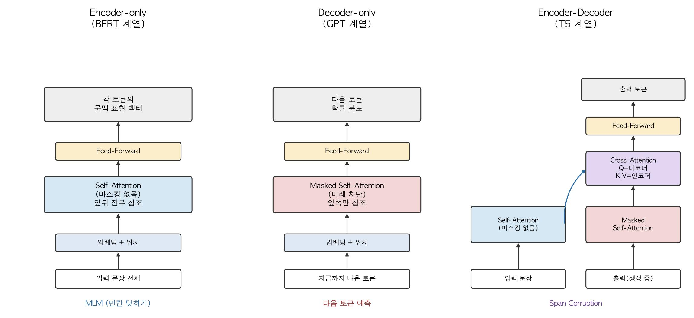
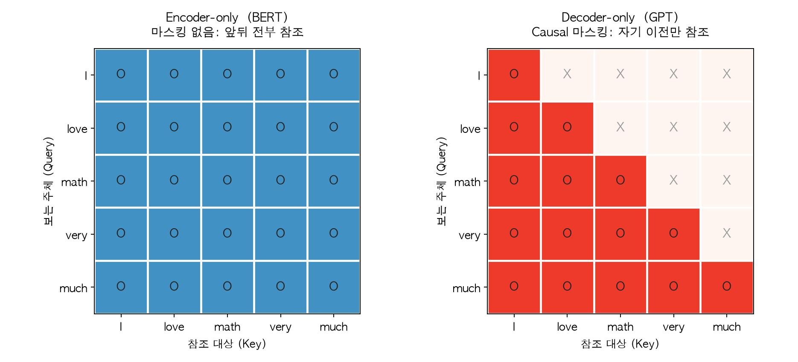

5주차까지 오면서 부품은 다 모였습니다. 1주차의 토큰화와 임베딩, 2주차의 순차 계산 문제, 3주차의 Attention, 4주차의 Self-Attention과 인코더·디코더 블록, 그리고 5주차에서 그 디코더 블록만 쌓아 올린 GPT-2까지 봤습니다.

그런데 GPT-2가 디코더만 쓴 건 여러 선택지 중 하나였습니다. 4주차에서 조립한 인코더 블록과 디코더 블록은 따로 쓸 수도, 원래 논문처럼 같이 쓸 수도 있습니다. 이번 글에서는 이 세 갈래가 각각 어떤 모델로 이어졌고, 무엇을 잘하고 못하며, 언제 무엇을 골라야 하는지 정리하겠습니다.



# 목차

1. 왜 갈라졌는가
2. Encoder-only (BERT 계열)
3. Decoder-only (GPT 계열)
4. Encoder-Decoder (T5 계열)
5. 무엇을 언제 쓰는가
6. 마무리

# 1. 왜 갈라졌는가

4주차에서 인코더 블록과 디코더 블록의 차이를 봤습니다. 정리하면 이렇습니다.

- 인코더 블록: Self-Attention + Feed-Forward
- 디코더 블록: Masked Self-Attention + Cross-Attention + Feed-Forward

그런데 Cross-Attention은 인코더가 있을 때만 쓸 수 있는 것이고, Feed-Forward는 양쪽에 똑같이 있습니다. 결국 **두 블록을 가르는 본질적인 차이는 Self-Attention에 마스킹이 걸려 있느냐 하나뿐입니다.**



마스킹이 없으면 모든 토큰이 앞뒤를 전부 봅니다. `I love math very much`에서 `math`가 자기 표현을 만들 때 앞의 `I`, `love`뿐 아니라 뒤의 `very`, `much`까지 참조합니다. 문장을 이미 다 받아놓고 그 의미를 파악하는 데 유리합니다.

마스킹이 있으면 각 토큰이 자기보다 앞쪽만 봅니다. `math`는 `I`, `love`, 그리고 자기 자신까지만 볼 수 있습니다. 정보가 제한되는 대신, **아직 뒤가 없는 상황에서도 예측이 가능해집니다.** 문장을 왼쪽부터 하나씩 만들어나가는 생성이 여기서 나옵니다.

이 하나의 차이가 세 갈래를 만듭니다.

| | 마스킹 | 할 수 있는 일 |
|---|---|---|
| Encoder-only | 없음 | 문장 전체를 읽고 이해 |
| Decoder-only | 있음 | 왼쪽부터 이어서 생성 |
| Encoder-Decoder | 인코더 없음 + 디코더 있음 | 읽기와 생성을 분업 |

# 2. Encoder-only (BERT 계열)

## 2.1. 구조와 사전학습

인코더 블록만 쌓습니다. 마스킹이 없으니 모든 토큰이 문장 전체를 봅니다. 그런데 여기서 문제가 하나 생깁니다. **GPT처럼 "다음 토큰 예측"으로 학습시킬 수가 없습니다.** 뒤를 이미 다 볼 수 있는데 다음 토큰을 맞히라고 하면, 정답을 보고 정답을 쓰는 셈이라 아무것도 배우지 못합니다.

그래서 BERT는 다른 학습 목표를 씁니다. 문장의 일부 토큰을 `[MASK]`로 가리고 그 자리에 뭐가 들어갈지 맞히게 하는 **MLM(Masked Language Modeling)**입니다.

```
입력:  The cat [MASK] on the mat.
정답:  sat
```

`sat`을 맞히려면 앞의 `The cat`과 뒤의 `on the mat` 양쪽을 다 봐야 합니다. 마스킹이 없는 구조가 오히려 장점이 되는 학습 방식입니다. 빈칸 채우기 문제를 푸는 것과 같아서, 흔히 **양방향(bidirectional)** 학습이라고 부릅니다.

## 2.2. 잘하는 것과 못하는 것

출력이 "각 토큰의 문맥 표현 벡터"입니다. 이 벡터를 그대로 쓰거나, 위에 작은 분류기를 하나 얹어서 씁니다.

- 문장 분류(감성 분석, 스팸 판별)
- 개체명 인식(문장 속 인물·지명 찾기)
- 문장 임베딩(검색, 유사도 비교)

반대로 **문장을 새로 만들어내지는 못합니다.** 다음 토큰을 예측하도록 학습된 적이 없고, 애초에 왼쪽부터 하나씩 만들어가는 구조가 아니기 때문입니다.

## 2.3. 계열 모델

- **BERT** (2018, Google): 이 계열의 출발점. MLM + NSP(다음 문장 예측)로 학습
- **RoBERTa** (2019, Meta): BERT에서 NSP를 빼고 데이터와 학습량을 크게 늘림
- **ELECTRA** (2020, Google): MLM 대신 "이 토큰이 바뀐 것인지" 판별하게 해서 학습 효율을 높임
- **DeBERTa** (2021, Microsoft): 토큰 내용과 위치를 분리해 어텐션을 계산

# 3. Decoder-only (GPT 계열)

## 3.1. 구조와 사전학습

디코더 블록만 쌓습니다. 인코더가 없으니 Cross-Attention도 없고, 남는 건 Masked Self-Attention과 Feed-Forward입니다. 5주차에서 GPT-2를 뜯어보며 이미 확인한 구조입니다.

학습 목표는 단순합니다. **다음 토큰 예측 하나뿐입니다.**

$$
p(x) = \prod_{i=1}^{n} p(s_i \mid s_1, ..., s_{i-1})
$$

라벨이 따로 필요 없습니다. 아무 글이나 가져와서 앞부분을 주고 다음 단어를 맞히게 하면 그게 곧 학습 데이터입니다. 인터넷에 있는 텍스트를 그대로 부어 넣을 수 있다는 뜻이고, 이게 이 계열이 압도적으로 커질 수 있었던 이유입니다.

## 3.2. 잘하는 것과 못하는 것

출력이 "다음 토큰의 확률 분포"라서 생성이 본업입니다.

- 텍스트 생성, 이어쓰기
- 대화, 질의응답
- 요약, 번역 (5주차에서 본 것처럼 zero-shot으로도 어느 정도)
- 코드 생성

약점은 마스킹 때문에 **각 토큰이 자기 뒤를 못 본다는 것**입니다. 문장 전체를 하나의 벡터로 요약해야 하는 작업(임베딩, 검색)에서는 BERT 계열보다 불리한 면이 있습니다. 마지막 토큰의 표현에는 뒤쪽 정보가 들어갈 수 없고, 앞쪽 토큰들은 뒤를 전혀 모르는 채로 표현이 굳어지기 때문입니다.

## 3.3. 계열 모델

- **GPT-2 / GPT-3 / GPT-4** (OpenAI): 5주차에서 본 그 계보
- **LLaMA** (Meta): 가중치를 공개해 오픈소스 생태계의 기반이 됨
- **Mistral** (Mistral AI), **Qwen** (Alibaba), **Gemma** (Google): 최근의 주요 오픈 모델
- **Claude** (Anthropic), **Gemini** (Google): 상용 대형 모델

**지금 우리가 "LLM"이라고 부르는 모델은 사실상 전부 이 계열입니다.**

# 4. Encoder-Decoder (T5 계열)

## 4.1. 구조와 사전학습

4주차에서 조립한 원래 Transformer 그대로입니다. 인코더가 입력을 읽고, 디코더가 Cross-Attention으로 그 결과를 참조하며 출력을 만듭니다.

T5의 사전학습 방식은 **span corruption**입니다. 입력에서 연속된 토큰 덩어리를 통째로 지우고, 디코더가 지워진 덩어리를 복원하게 합니다.

```
원문:   Thank you for inviting me to your party last week.
입력:   Thank you <X> me to your party <Y> week.
정답:   <X> for inviting <Y> last
```

BERT의 MLM이 토큰 하나씩 가렸다면, T5는 여러 토큰을 묶어서 가리고 그걸 **생성으로** 복원합니다. 인코더로 읽고 디코더로 쓰는 구조를 그대로 활용하는 학습법입니다.

## 4.2. 잘하는 것과 못하는 것

입력과 출력이 확실히 구분되는 작업에 강합니다.

- 번역 (원문 → 번역문)
- 요약 (긴 글 → 짧은 글)
- 문법 교정, 스타일 변환

인코더가 입력을 마스킹 없이 양방향으로 충분히 읽고, 그 결과를 디코더가 매 시점 Cross-Attention으로 참조합니다. **읽기 전담과 쓰기 전담이 나뉘어 있다는 게 이 구조의 강점**입니다.

여기서 한 가지 구분해둘 게 있습니다. 2장의 Encoder-only가 생성을 **못 하는** 것은 구조적인 문제였습니다. 출력이 애초에 다음 토큰의 확률 분포가 아니라 각 토큰의 표현 벡터라, 문장을 만들어낼 방법 자체가 없습니다. 반면 여기서 말하는 강점은 그런 가능/불가능의 문제가 아닙니다. **Decoder-only도 번역과 요약을 할 수 있습니다.** 5주차에서 GPT-2로 직접 해봤고, 잘하진 못했지만 태스크 자체는 수행했습니다. Encoder-Decoder가 낫다는 건 구조가 태스크의 모양과 맞아떨어져 더 안정적으로 해낸다는 뜻입니다.

단점은 **파라미터가 두 배로 든다**는 것입니다. 인코더와 디코더를 따로 둬야 하니 같은 성능을 내려면 더 큰 모델이 필요합니다. 그리고 입력과 출력의 경계가 분명한 작업이 아니면(예: 자유로운 대화) 이 분업 구조의 이점이 잘 살지 않습니다.

## 4.3. 계열 모델

- **T5** (2019, Google): 모든 NLP 태스크를 "텍스트 → 텍스트"로 통일한 모델
- **BART** (2019, Meta): 문장 순서 섞기 등 다양한 노이즈로 학습
- **mT5 / mBART**: 다국어 확장판
- **Flan-T5** (2022, Google): T5를 여러 태스크 지시문으로 추가 학습

# 5. 무엇을 언제 쓰는가

## 5.1. 태스크별 선택

| 하려는 일 | 적합한 구조 | 이유 |
|---|---|---|
| 문서 분류, 감성 분석 | Encoder-only | 문장 전체를 양방향으로 읽어야 함, 생성 불필요 |
| 검색, 유사도 비교 | Encoder-only | 문장을 하나의 벡터로 잘 요약해야 함 |
| 대화, 이어쓰기, 코드 생성 | Decoder-only | 왼쪽부터 이어가는 생성이 본업 |
| 번역, 요약 | Encoder-Decoder 또는 Decoder-only | 전자는 구조적으로 적합, 후자는 규모로 해결 |

## 5.2. 왜 결국 Decoder-only가 주류가 되었나

지금 LLM이라 불리는 모델은 거의 전부 Decoder-only입니다. 이유는 세 가지로 정리할 수 있습니다.

**하나. 학습 데이터를 만들 필요가 없습니다.** BERT의 MLM은 어디를 가릴지 정하는 규칙이 필요하고, T5의 span corruption도 마찬가지입니다. 반면 다음 토큰 예측은 아무 텍스트나 그대로 쓰면 됩니다. 데이터를 무한히 부어 넣을 수 있다는 게 규모 경쟁에서 결정적이었습니다.

**둘. 한 모델로 모든 걸 할 수 있습니다.** 4.2절에서 봤듯 Decoder-only도 번역과 요약을 수행할 수는 있습니다. 태스크를 자연어로 적어 넣기만 하면 되니, 태스크마다 다른 모델을 준비하고 각각 fine-tuning할 필요가 없습니다. 구조적으로 더 적합한 모델을 여러 개 갖추는 것보다, 하나로 다 되는 쪽이 실무에서 훨씬 다루기 쉽습니다.

**셋. 규모가 커지면 구조적 이점이 상쇄됩니다.** Encoder-Decoder가 번역에 유리한 건 여전히 맞습니다. 다만 그 이점은 같은 크기일 때의 이야기고, 충분히 큰 Decoder-only 모델은 구조적 불리함을 규모로 덮어버립니다. 구조를 정교하게 다듬는 것보다 데이터와 파라미터를 늘리는 쪽이 더 잘 통했고, 첫 번째 이유(데이터를 무한히 넣을 수 있다) 덕분에 Decoder-only만 그 규모까지 갈 수 있었습니다.

## 5.3. 나머지 둘의 처지는 다릅니다

Decoder-only가 주류가 됐다고 나머지가 똑같이 밀려난 건 아닙니다. 둘의 상황이 꽤 다릅니다.

**Encoder-only는 확실한 자기 자리가 있습니다.** 검색 엔진의 문서 임베딩, 추천 시스템의 텍스트 벡터화, 대량 문서 분류처럼 **생성이 필요 없고 속도와 비용이 중요한 곳**에서는 작고 빠른 Encoder-only 모델이 훨씬 합리적입니다. 수억 건의 문서를 벡터로 바꾸는 데 수십억 파라미터짜리 생성 모델을 돌릴 이유가 없습니다. 문장을 하나의 벡터로 요약하는 일은 3.2절에서 본 Decoder-only의 약점이기도 해서, 이쪽은 대체가 잘 일어나지 않습니다.

**Encoder-Decoder는 사정이 애매합니다.** 구조적으로는 여전히 우아하고 번역·요약에 잘 맞지만, 그 자리를 Decoder-only가 거의 다 잠식했습니다. 지금 사람들이 실제로 쓰는 LLM 중에 Encoder-Decoder 구조인 것은 사실상 없습니다. ChatGPT, Claude, Gemini, LLaMA, Qwen, Mistral 전부 Decoder-only입니다. T5 계열은 연구용 백본이나 특정 태스크에 fine-tuning하는 용도로 남아 있고, "이건 반드시 Encoder-Decoder여야 한다"고 말할 수 있는 영역이 계속 줄어드는 중입니다.

정리하면 Encoder-only는 **생성이 필요 없는 영역을 나눠 가진 것**이고, Encoder-Decoder는 **자기 영역을 내주고 있는 쪽**에 가깝습니다.

# 6. 마무리

RNN이 기울기 소실로 긴 문장을 못 읽자 LSTM이 게이트로 보완했고, 입출력 길이가 다른 문제를 못 풀자 Seq2Seq가 인코더와 디코더로 나눴습니다. 고정 길이 병목이 생기자 Attention이 매 시점 다시 참조하는 방식으로 풀었고, 인코더의 순차 계산이 남자 Self-Attention이 RNN을 걷어냈습니다. 그렇게 만들어진 Transformer의 두 블록을 어떻게 조합하느냐에서 세 갈래가 갈렸고, 그중 Decoder-only가 지금의 LLM이 되었습니다.

여섯 주에 걸쳐 따라온 것은 결국 하나의 질문이었습니다. **어떻게 하면 컴퓨터가 사람의 말을 다룰 수 있는가.** 답은 한 번에 나오지 않았고, 매번 이전 방법의 한계를 하나씩 메우며 여기까지 왔습니다. 지금의 LLM도 완성형이 아니라 그 과정의 한 지점일 뿐입니다.
